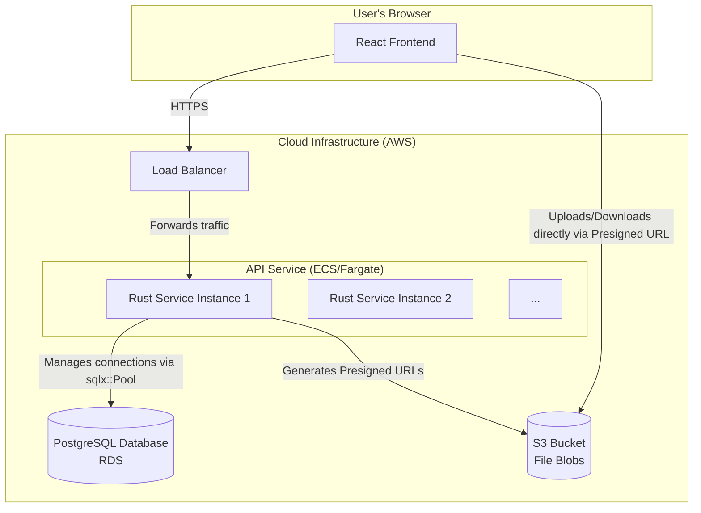
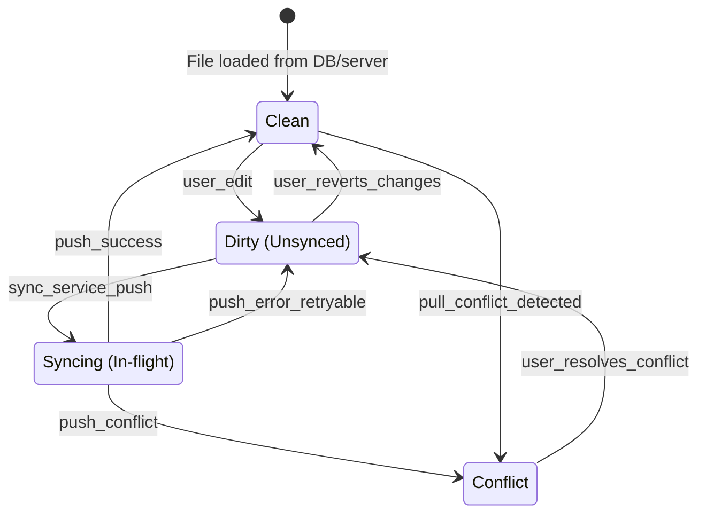
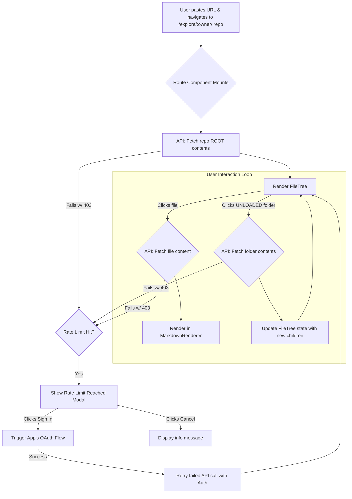

## Problem Summary

The objective is to design a new, from-scratch architecture for a high-performance markdown editor application, `mdstudio.io`. This new design will replace the existing proof-of-concept. The system must feature a Rust-based backend service for robust file synchronization with an S3 object store, abandoning the previous Git-based approach. The frontend will be an offline-first React application using IndexedDB as a local cache, managed by a predictable, event-driven state model. Additionally, the design must include a client-only, read-only viewer for Browse public GitHub repositories.

-----

## What is the core architecture for the backend service that balances performance, scalability, and operational simplicity for S3-based file synchronization?

The ideal backend architecture is a stateless, compiled Rust service that acts as a secure and intelligent gateway to S3 and a metadata database. This design prioritizes performance, type safety, and low resource consumption while offloading heavy lifting like file storage and transfers to specialized cloud services.

### Core Technology Stack: A Deeper Look

  * **Language/Framework**: **Rust** with the **Axum** web framework.
      * **Insight**: While both Axum and Actix-web are top-tier, Axum's design philosophy is particularly well-suited for this project. It is built upon the `tower` middleware ecosystem, which provides incredible composability for handling concerns like authentication, logging, and rate-limiting in a modular way. Axum’s powerful extractor pattern also simplifies request handling and provides compile-time guarantees that your handlers have the correct inputs, reducing runtime errors.
  * **Database**: **PostgreSQL** with the **`sqlx`** crate.
      * **Insight**: I recommend PostgreSQL over a NoSQL alternative because the data model is inherently relational (users own workspaces, which contain files). Postgres enforces this data integrity at the database level. Using `sqlx` is a significant advantage as it checks your SQL queries against the database schema *at compile time*, catching potential errors long before they reach production.
      * **Tip**: Use PostgreSQL's `JSONB` column type to store flexible metadata for workspaces or files in the future without needing schema migrations.
  * **Object Storage**: **AWS S3** with **S3 Versioning** enabled.
      * **Insight**: Enabling versioning is a critical, non-negotiable part of this design. It's your safety net. Every file upload (even overwrites) creates a new version. This means you can easily roll back a file to a previous state or recover an accidentally deleted file. This provides a robust "version history" feature for free.
  * **Authentication**: **JWT (JSON Web Tokens)**.
      * **Trick**: Store the JWT in a secure, `HttpOnly` cookie on the client. This is more secure than using `localStorage` as it prevents access from client-side JavaScript, mitigating XSS (Cross-Site Scripting) attacks. Axum middleware can be written to automatically extract and validate this token on protected routes.

-----

### System Component Diagram

  * **Explanation**: Notice the crucial direct link from the `Client` to `S3`. The Rust service doesn't proxy the file data. It acts as a controller, providing the client with a temporary, secure URL to talk directly to S3. This is the key to scalability.

-----

### API Design & Synchronization Protocol: A Deeper Look

The `POST /workspaces/{workspace_id}/sync` endpoint is the heart of the system.

**Key Insight: Why Presigned URLs are Superior**
Using presigned URLs is a fundamental pattern for scalable cloud applications.

1.  **Security**: The backend grants very specific, short-lived permissions (e.g., "allow a `PUT` operation on exactly this key: `workspaces/123/file.md` for the next 5 minutes"). The client never touches a permanent AWS credential.
2.  **Performance**: The user's machine communicates directly with AWS's global, high-bandwidth infrastructure. Your Rust server's network I/O is freed up to handle more API requests instead of being tied up streaming large file uploads or downloads.
3.  **Scalability**: Your API service can handle thousands of sync requests per second because it's only dealing with lightweight JSON metadata, not megabytes of file data.

**Detailed Sync Flow:**

1.  The client sends its list of local file versions, using the `s3_version_id` it received from the last successful sync. It also sends a list of pending local changes.
2.  The Rust server performs a highly efficient metadata comparison:
      * It queries its PostgreSQL `files` table for the given `workspace_id`.
      * It compares this list with the list provided by the client.
      * **Tip**: This comparison can be done with a single, efficient SQL query or by loading the lists into HashMaps in memory for rapid lookups.
3.  Based on the comparison, the server generates the response:
      * For files the client needs to **upload**, it generates a `PUT` presigned URL.
      * For files the client needs to **download**, it generates a `GET` presigned URL.
      * **Trick**: When generating the `GET` URL for a download, you can specify the exact `versionId` to ensure the client fetches the version the server expects, preventing race conditions.
      * The server updates its PostgreSQL database with the metadata for the newly uploaded/deleted files *after* the client confirms the S3 operations are complete (or handles this transactionally).

This architecture provides a secure, highly scalable, and operationally simple backend that is perfectly tailored to the application's needs.

-----

## How should the frontend be architected to ensure a seamless offline-first user experience and a clear, event-driven data flow?

To achieve a truly offline-first experience and the desired event-driven data flow, the frontend should be architected in three distinct layers: **UI Components**, a **Central State Store**, and a **Service Layer**. This separation of concerns is critical for creating a clean, testable, and scalable application that neatly avoids the complexity of tangled `useEffect` hooks.

### Frontend Architectural Layers: A Deeper Look

1.  **UI Components (React)**: These are the "dumb" visual elements. Their only job is to translate the application state into HTML and CSS.
      * **Suggestion**: Use a component library like **Shadcn/ui** (which your POC already uses) to build the visual elements. Focus on creating small, composable components. A component should ideally do one thing: either display data or capture user input, but not both plus business logic.
2.  **State Store (Zustand)**: This is the brain of your UI.
      * **Insight**: The power of Zustand over simple React Context is its selective subscription model. A component can subscribe to just one piece of state (`const files = useAppStore(state => state.files);`). When another part of the state changes (e.g., the theme), this component will *not* re-render, leading to significant performance gains.
3.  **Service Layer (TypeScript Modules)**: This is your abstraction boundary. It isolates your application logic from the outside world.
      * **`IndexedDBService`**: All Dexie.js code should live here. No other part of the app should know that you're using Dexie. This makes it easy to add logging, error handling, or even swap out the database library in the future.
      * **`ApiService`**: All `fetch` calls to your Rust backend live here. It handles setting auth headers, parsing JSON responses, and handling network errors.
      * **`SyncService`**: This orchestrates the other two services to perform the synchronization logic.

### Event-Driven Data Flow & Optimistic UI

The key to a snappy offline-first experience is the **optimistic UI update**.

**Detailed Flow for Editing a File:**

1.  **User Action**: User types in the editor.
2.  **Dispatch Event**: The `onChange` handler of the `Textarea` calls an action from the Zustand store, e.g., `updateFileContent(filePath, newContent)`.
3.  **State Mutation (Optimistic Update)**: The `updateFileContent` action in the store **immediately** updates the state with the new content. The UI re-renders instantly, providing a seamless experience.
4.  **Side Effect Handling**: The action then, without blocking, calls the `IndexedDBService` to persist the change locally. It also adds an entry to a `sync_queue` table in IndexedDB, marking this file as "dirty" and needing to be pushed to the server.
5.  **Synchronization**: Independently, the `SyncService` runs on a timer or when the network becomes available. It reads the `sync_queue`, sends the changes to the Rust backend, and processes the response, updating the local IndexedDB with any new data from the server.

### Mermaid Diagram: File State Lifecycle

This state diagram visualizes the lifecycle of a file within the frontend system, driven by user and system events.

-----

## What is the most robust and user-friendly design for the client-only GitHub Repository Viewer, considering its read-only nature and the constraints of browser environments?

The most robust design for this feature is a **self-contained, route-based viewer that employs lazy-loading for repository data** and includes a **graceful upgrade path to mitigate API rate limits**. This architecture ensures a fast initial load, conserves API requests, and provides a seamless user experience even under the constraints of the browser.

### Architectural Design: A Deeper Look

**Principle: Separation of Concerns**
The key insight here is that the state for viewing a temporary, public repository is fundamentally different from the state of a user's persistent, private workspace. Mixing them in the same global store would add unnecessary complexity.

  * **State Management**: Use local component state (`useState`, `useReducer`). A `useReducer` is particularly well-suited here to manage the complex state of the file tree, open files, and loading statuses in a predictable way.
  * **Routing**: Using a route like `/explore/:owner/:repo` makes the feature powerful and shareable. A user can send a link to a colleague pointing directly to a rendered markdown file within a specific public repository on your platform.

### On-Demand Fetching: The Core of the Implementation

This is the most critical part of the design to ensure performance and avoid hitting rate limits.

**Tip for `FileTree.tsx` modification:**
Your existing `FileTree` component can be adapted to support this.

1.  Add a new prop, `onFolderExpand`, to the `FileTreeItem` component.
2.  Inside `FileTreeItem`, when a user clicks to expand a folder, check if its `children` array has been populated.
3.  If it hasn't, show a loading spinner and call `onFolderExpand(item.path)`.
4.  The parent `GitHubRepoViewer` component will handle this event, make the API call to fetch the subdirectory's contents, and then update the state, which will flow back down and populate the `children`.

### Mitigating the Primary Risk: API Rate Limiting

An unauthenticated, client-side application is subject to the GitHub API's public rate limit (currently 60 requests/hour per IP). The following multi-layered strategy makes the feature robust and user-friendly.

**Layer 1: Efficient API Usage (The Default)**

  * **Lazy Loading**: As detailed above, this is your first and best defense.
  * **Session Caching**: This is a simple but highly effective trick. Before any API call, have a wrapper function that checks `sessionStorage`.

**Layer 2: Graceful Upgrade Path (The User Experience Win)**

This strategy turns a technical limitation into a feature that benefits the user and encourages engagement.

  * **Insight**: The core idea is to never present the user with a dead end. Always provide a path forward.
  * **Implementation Trick**: When you catch the rate-limit error, you can also read the `X-RateLimit-Reset` header from the response. This is a Unix timestamp indicating when the limit will reset. You can display this to the user: "You've reached the public limit. You can try again in **15 minutes** or sign in now for a higher limit." This provides transparency and manages user expectations perfectly.

### Mermaid Diagram: GitHub Viewer User & Data Flow

This flowchart illustrates the complete user journey, including the crucial lazy-loading and rate-limit handling logic.

